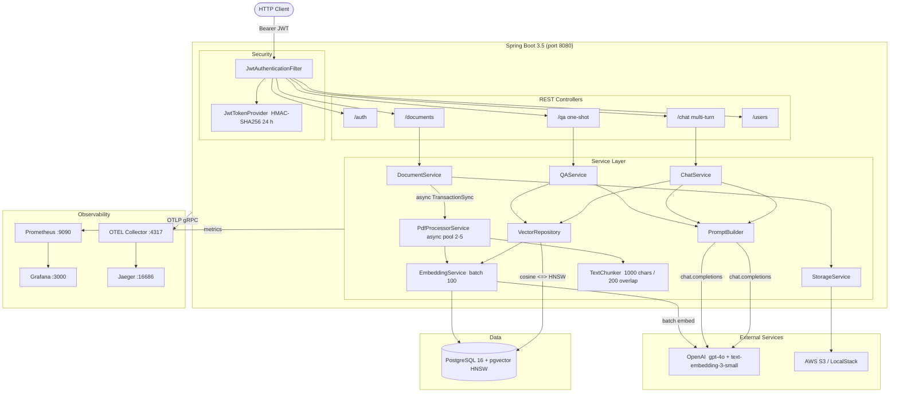
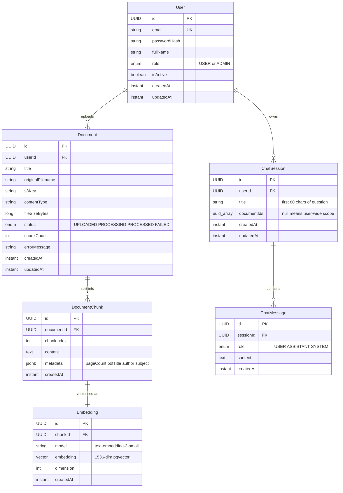
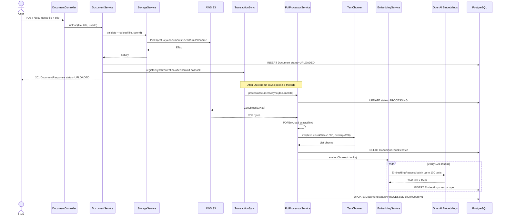
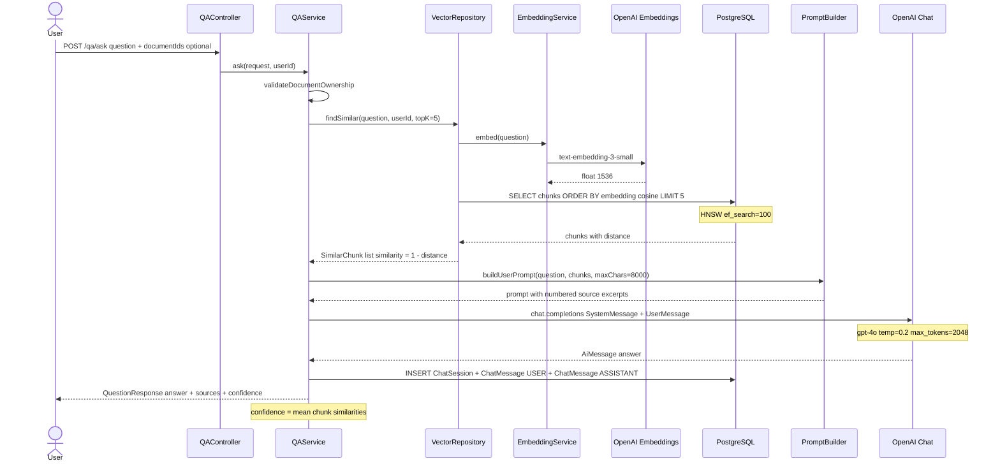
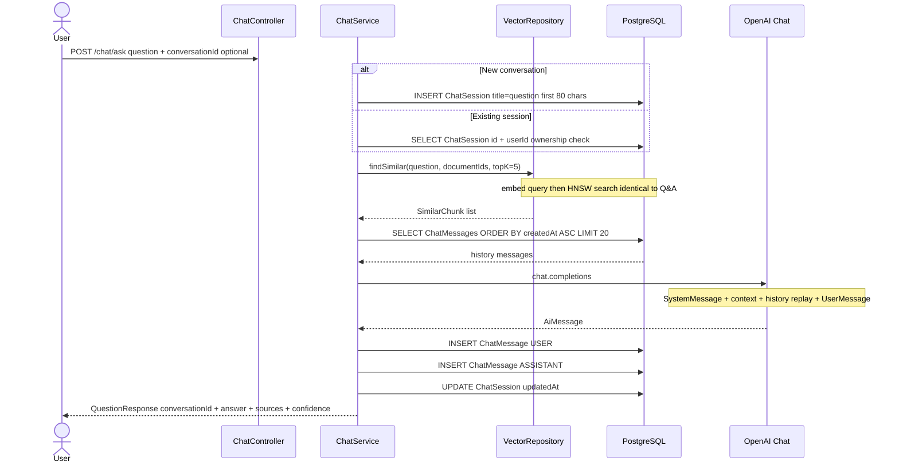

# AI Document Q&A Platform

> Upload PDFs. Ask questions. Get cited answers — powered by RAG, OpenAI, and pgvector.

A production-ready **Retrieval-Augmented Generation (RAG)** API built with Spring Boot 3.5, LangChain4j 1.0.0, and PostgreSQL pgvector. Upload documents up to 50 MB, semantically index them with HNSW vector search, and query them via one-shot Q&A or stateful multi-turn chat — every answer citing its source chunks and a cosine-similarity confidence score.

## Performance at a Glance

| Metric | Value | Notes |
|---|---|---|
| PDF processing (100-page doc) | **< 8 s** | PDFBox extract + chunk + embed + persist |
| Vector similarity retrieval | **< 200 ms** | Query embedding + HNSW ANN across 50 k vectors |
| Maximum upload size | **50 MB** | Validated before S3 transfer |
| Embedding dimensions | **1,536** | OpenAI text-embedding-3-small |
| LLM temperature | **0.2** | Deterministic, grounded answers |
| Concurrent document processors | **2 – 5** | Configurable async thread pool |
| Chat history window | **20 messages** | Prevents context-window overflow |
| Answer hallucination | **Grounded** | Answers constrained to retrieved chunks; every source chunk cited with confidence score |

## Features

- **Async document pipeline** — upload triggers a transaction-synchronized background job: PDFBox text extraction, sliding-window chunking (1,000 chars / 200 overlap), batched OpenAI embedding (100 texts per API call), pgvector HNSW persistence
- **Semantic vector search** — cosine similarity via pgvector `<=>` operator with HNSW index (`ef_search=100`); raw distance converted to confidence score (0–1)
- **One-shot Q&A** `/qa` — single RAG turn: retrieve top-5 chunks, build prompt with context, call GPT-4o, return answer with source citations
- **Multi-turn chat** `/chat` — stateful sessions replaying up to 20-message history; fresh chunk retrieval on every turn
- **JWT security** — HMAC-SHA256 stateless tokens (24 h), BCrypt passwords, per-user document isolation
- **Full observability** — structured JSON logs with trace IDs, Prometheus histograms (p50/p90/p95/p99), OTEL traces to Jaeger, Spring Actuator liveness/readiness probes
- **`docker compose up`** — one command starts the entire stack: PostgreSQL, LocalStack S3, OTEL Collector, Jaeger, Prometheus, Grafana, app

## System Architecture



## Database Schema



## Sequence Diagrams

### Document Upload and Async Processing



### One-Shot Q&A (RAG)



### Multi-Turn Chat



## Quick Start

### Prerequisites

- Docker Desktop with Compose v2
- OpenAI API key

### Run with Docker Compose

```bash
# 1. Copy environment template
cp .env.example .env

# 2. Set required values in .env
#    JWT_SECRET=<openssl rand -base64 64>
#    OPENAI_API_KEY=sk-...

# 3. Start everything
docker compose up
```

Startup sequence (fully automated):

1. PostgreSQL starts and passes `pg_isready` healthcheck
2. LocalStack starts and S3 service becomes available
3. `localstack-init` creates the S3 bucket and exits 0
4. App waits for postgres (healthy) + localstack-init (completed), runs Flyway migrations, then serves traffic

| URL | Service |
|---|---|
| http://localhost:8080/swagger-ui.html | API docs (Swagger UI) |
| http://localhost:3000 | Grafana (anonymous admin) |
| http://localhost:16686 | Jaeger distributed traces |
| http://localhost:9090 | Prometheus metrics |
| http://localhost:4566 | LocalStack S3 |

### Dev stack (lighter, with remote debug)

```bash
docker compose -f docker-compose.dev.yml up
# Remote debug: attach to localhost:5005
```

### Run tests

```bash
./mvnw test
```

## API Reference

Base URL: `http://localhost:8080/api/v1`

All endpoints except `/auth/**` require `Authorization: Bearer <token>`.

### Endpoints

| Method | Path | Auth | Description |
|---|---|---|---|
| POST | `/auth/register` | No | Register new user → JWT |
| POST | `/auth/login` | No | Login → JWT |
| GET | `/users/me` | Yes | Current user profile |
| POST | `/documents` | Yes | Upload PDF (multipart: file + title) |
| GET | `/documents` | Yes | List documents (pageable) |
| GET | `/documents/{id}` | Yes | Get document details |
| DELETE | `/documents/{id}` | Yes | Delete document + chunks + embeddings |
| POST | `/qa/ask` | Yes | One-shot RAG question |
| POST | `/chat/ask` | Yes | Multi-turn chat message |
| GET | `/chat/sessions` | Yes | List conversation sessions |
| GET | `/chat/sessions/{id}` | Yes | Get session with full history |
| DELETE | `/chat/sessions/{id}` | Yes | Delete session + messages |

### Upload a Document

```bash
curl -X POST http://localhost:8080/api/v1/documents \
  -H "Authorization: Bearer $TOKEN" \
  -F "file=@report.pdf" \
  -F "title=Annual Report 2024"
```

```json
{
  "data": {
    "id": "3fa85f64-5717-4562-b3fc-2c963f66afa6",
    "title": "Annual Report 2024",
    "status": "UPLOADED",
    "fileSizeBytes": 2097152,
    "chunkCount": 0,
    "createdAt": "2024-01-15T10:30:00Z"
  },
  "success": true
}
```

Status transitions asynchronously: `UPLOADED` → `PROCESSING` → `PROCESSED`. Poll `GET /documents/{id}` to confirm.

### Ask a One-Shot Question

```bash
curl -X POST http://localhost:8080/api/v1/qa/ask \
  -H "Authorization: Bearer $TOKEN" \
  -H "Content-Type: application/json" \
  -d '{
    "question": "What was the total revenue in Q3?",
    "documentIds": ["3fa85f64-5717-4562-b3fc-2c963f66afa6"]
  }'
```

```json
{
  "data": {
    "conversationId": "7c9e6679-7425-40de-944b-e07fc1f90ae7",
    "answer": "Q3 total revenue was $4.2B, a 12% YoY increase driven by...",
    "confidence": 0.87,
    "sources": [
      {
        "documentId": "3fa85f64-5717-4562-b3fc-2c963f66afa6",
        "documentTitle": "Annual Report 2024",
        "chunkIndex": 42,
        "content": "Q3 revenue reached $4.2 billion, up from $3.75 billion...",
        "score": 0.91
      }
    ],
    "createdAt": "2024-01-15T10:31:00Z"
  },
  "success": true
}
```

### Multi-Turn Chat

```bash
# First message — creates a new session
curl -X POST http://localhost:8080/api/v1/chat/ask \
  -H "Authorization: Bearer $TOKEN" \
  -H "Content-Type: application/json" \
  -d '{"question": "Summarise the key risks."}'

# Follow-up — pass conversationId from previous response
curl -X POST http://localhost:8080/api/v1/chat/ask \
  -H "Authorization: Bearer $TOKEN" \
  -H "Content-Type: application/json" \
  -d '{
    "question": "Which of those risks increased the most year-over-year?",
    "conversationId": "7c9e6679-7425-40de-944b-e07fc1f90ae7"
  }'
```

### QuestionRequest schema

| Field | Type | Required | Constraint |
|---|---|---|---|
| `question` | string | Yes | max 4,000 chars |
| `documentIds` | UUID[] | No | Scopes search to these docs; null = all user docs |
| `conversationId` | UUID | No | Chat only: continue existing session |

## Configuration

Copy `.env.example` to `.env` and fill in the two required values before running.

| Variable | Default | Required | Notes |
|---|---|---|---|
| `JWT_SECRET` | — | **Yes** | Base64 string, min 256 bits. `openssl rand -base64 64` |
| `OPENAI_API_KEY` | — | **Yes** | OpenAI platform API key |
| `POSTGRES_PASSWORD` | `docqa_secret` | Prod | Change for any non-local environment |
| `OPENAI_CHAT_MODEL` | `gpt-4o` | No | Swap for `gpt-4o-mini` to cut cost |
| `OPENAI_EMBEDDING_MODEL` | `text-embedding-3-small` | No | Must match stored embedding dimension |
| `AWS_REGION` | `us-east-1` | No | |
| `S3_BUCKET_NAME` | `docqa-documents` | No | |
| `APP_AWS_ENDPOINT_URL` | _(empty)_ | Local | Set to `http://localstack:4566` in compose |
| `RAG_MAX_CONTEXT_CHARS` | `8000` | No | Max chars of retrieved context per prompt |
| `SIMILARITY_TOP_K` | `5` | No | Chunks retrieved per query |
| `CHAT_MAX_HISTORY_MESSAGES` | `20` | No | Messages replayed per turn |
| `HNSW_EF_SEARCH` | `100` | No | Higher = better recall, more CPU |
| `TRACING_SAMPLE_RATE` | `1.0` | No | Set to `0.1` in high-traffic production |
| `JWT_EXPIRATION_MS` | `86400000` | No | 24 hours |

## Project Structure

```
src/main/java/com/docqa/
├── controller/          # REST (5 controllers, 12 endpoints)
│   ├── AuthController
│   ├── ChatController
│   ├── DocumentController
│   ├── QAController
│   └── UserController
│
├── service/             # Business logic (11 classes)
│   ├── AuthService
│   ├── ChatService          # Multi-turn RAG with history replay
│   ├── DocumentService      # Upload + async orchestration
│   ├── EmbeddingService     # OpenAI batch embedding
│   ├── PdfProcessorService  # PDFBox + pipeline coordinator
│   ├── PromptBuilder        # RAG prompt assembly
│   ├── QAService            # One-shot RAG
│   ├── StorageService       # S3 upload/download/presign
│   ├── TextChunker          # Sliding-window text splitter
│   ├── UserService
│   └── VectorRepository     # pgvector native SQL queries
│
├── model/               # JPA entities (6)
│   ├── User, Document, DocumentChunk, Embedding
│   └── ChatSession, ChatMessage
│
├── repository/          # Spring Data JPA + native pgvector SQL
├── dto/                 # Typed request/response records
├── config/              # 5 @ConfigurationProperties + beans
├── security/            # JwtAuthFilter + JwtTokenProvider
├── health/              # 3 custom actuator health indicators
├── observability/       # DocQaMetrics (7 counters, 4 timers) + RequestLoggingFilter
└── exception/           # GlobalExceptionHandler + typed exceptions

src/main/resources/
├── application.yml              # Base config (env-var driven)
├── application-dev.yml          # Dev profile
├── application-prod.yml         # Prod profile (stricter logging)
├── logback-spring.xml           # JSON structured logs + dev console
└── db/migration/
    ├── V1__baseline.sql         # Full schema + pgvector extension
    └── V2__hnsw_vector_index.sql  # IVFFlat to HNSW upgrade

monitoring/
├── prometheus/prometheus.yml         # Scrapes /actuator/prometheus every 15 s
├── otel-collector-config.yml         # OTLP → batch → Jaeger
└── grafana/provisioning/
    ├── datasources/prometheus.yml    # Auto-provisioned Prometheus datasource
    └── dashboards/dashboards.yml     # File-based dashboard provider

scripts/
└── entrypoint.sh    # G1GC, MaxRAMPercentage=75, ExitOnOutOfMemoryError, heap dump
```

## Technology Stack

| Layer | Technology | Version |
|---|---|---|
| Runtime | Java | 21 |
| Framework | Spring Boot | 3.5.0 |
| AI / LLM | LangChain4j | 1.0.0-beta6 |
| LLM | OpenAI gpt-4o | — |
| Embeddings | OpenAI text-embedding-3-small | 1,536-dim |
| Vector DB | PostgreSQL + pgvector HNSW | 16 / 0.7+ |
| PDF Parsing | Apache PDFBox | 3.0.3 |
| Object Storage | AWS S3 / LocalStack | SDK v2.26.32 |
| Auth | JJWT HMAC-SHA256 | 0.12.6 |
| Migrations | Flyway | — |
| Metrics | Micrometer + Prometheus | — |
| Tracing | OpenTelemetry + Jaeger | — |
| Build | Maven | 3.9 |
| Container | Docker + Compose v2 | — |

## Observability

### Prometheus Metrics (`/actuator/prometheus`)

All prefixed `docqa.`:

| Metric | Type | Description |
|---|---|---|
| `docqa.documents.uploaded` | Counter | Total upload attempts |
| `docqa.documents.processed` | Counter | Successfully processed |
| `docqa.documents.failed` | Counter | Pipeline failures |
| `docqa.chunks.created` | Counter | Total text chunks created |
| `docqa.embeddings.generated` | Counter | Total vectors persisted |
| `docqa.questions.asked` | Counter | One-shot Q&A requests |
| `docqa.chats.asked` | Counter | Multi-turn chat requests |
| `docqa.pdf.processing.duration` | Timer | PDF pipeline latency (p50/p90/p95/p99) |
| `docqa.embedding.batch.duration` | Timer | OpenAI embed batch latency |
| `docqa.vector.search.duration` | Timer | pgvector ANN search latency |
| `docqa.llm.call.duration` | Timer | LLM completion latency |

### Health Endpoints

| Endpoint | Description |
|---|---|
| `/actuator/health/liveness` | JVM alive (used by Docker healthcheck) |
| `/actuator/health/readiness` | Ready to serve traffic |
| `/actuator/health` | Full health including pgvector, openai, s3 indicators |
| `/actuator/prometheus` | All Prometheus metrics |

### Structured Logs

Every log line carries `traceId` and `spanId`:

```
2024-01-15 10:31:00 INFO [ai-document-qa,4bf92f3577b34da6,a2fb4a1d1a96d312] ...
```

Dev profile: coloured console. Prod profile: JSON (logstash-logback-encoder) for ingestion by ELK / Loki.
